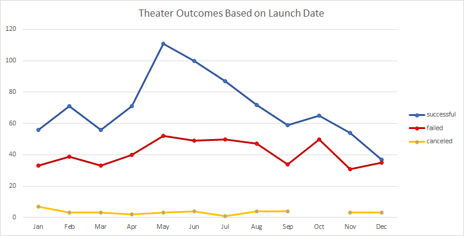

# Kickstarting with Excel

## Overview of Project

### Purpose

Previously we helped a playwright Louise plan crowdfunding goals for her new play "Fever" by looking at historical trends in the same industry. Louise has just wrapped up fundraising, and now wants to compare her success with other campaigns. She wants to specifically look at a comparison of funding goals and launch dates. 

## Analysis and Challenges

### Analysis of Outcomes Based on Launch Date

If we look at all Parent Categories based on launch date, we can see that ~54% of projects that have wrapped up were successful, ~38% failed, and ~8% were canceled. If we narrow it down to look specifically at theater outcomes, we see a similar distribution as the overall, with ~61% being successful, ~36% failing, and ~3% being canceled. From the graph "Theater Outcomes Based on Launch Date" included below, it's clear that the months with the most successful outcomes were May, June and July. Those 3 months alone made up for more than half of all successful theater outcomes. The months with the most failed outcomes is relatively stable all year, with spikes in May, June, July and October. Additionally, canceled events are very stable all year round, with one small uptick at the beginning of the year. When looking at the percentage of successful campaigns compared to all campaigns for each month, the distribution is relatively stable (~60%), however is higher in May and June at 67% and 65% respectively. In contrast, when performing the same analysis on failed campaigns to overall, the percentage of failed campaigns by month drops to its lowest likelihood for May and June at 31% and 32% respectively. These figures can be seen in the table "Monthly Percentage Distribution" below. 

### Analysis of Outcomes Based on Goals

Overall based on the data in "Outcomes Based on Goals" majority of projects fell below a $10,000 goal (~85%), with most of the distribution being between $999 and $4,999 (~51%). This calculation was done by performing (SUM(Total Projects of Less than 1000,1000 to 4999,5000 to 9999)/SUM(Total Projects)) for whole distribution, and (SUM(Total Projects of 1000 to 4999)/SUM(Total Projects)) for the distribution between $999 and $4,999. Similar to the previous analysis done, majority of plays are successful (~66%). There are also no canceled plays. There is a high correlation between having the play's financial goal being greater than $50,000 and failing (~88% failed in this category), which is further highlighted in the graph "Outcomes Based on Goal" below. The percentage of projects with the highest success rate were below $4,999, with 76% of projects being successful that were less than 1000, and 73% being successful between $1,000 and $4,999. 

### Challenges and Difficulties Encountered

One difficulty I found when interpreting the data was understanding which fields would be helpful and which ones didn't matter. Also that the "goal" field was all in different base currencies, so it felt difficult to assign an accurate dollar value to the different buckets. The count function still held and provided insight into where we could find trends in the data, so this helped as a work around. Majority of the data is also in USD/CAD (~75%), so this gave confidence that although there will be outliers due to conversion rates, majority of the data is comparable. We can also convert all currencies to USD using an exchange rate database and then compare after that. 

## Results

- What are two conclusions you can draw about the Outcomes based on Launch Date?

Based on the above analysis in the "Analysis and Challenges" section, we can conclude that most campaigns are launched in the summer months of May, June and July. Additionally, when looking at the percentage of successful and failed campaigns on a monthly basis, we see the highest overall distribution for success in May and June, and lowest likelihood for failure in May and June as well, which implies that lauching in the summer months of May and June provide the highest likelihood for success. 

- What can you conclude about the Outcomes based on Goals?

Based on the above analysis in the "Analysis and Challenges" section, we can conclude that most projects have a financial goal of less than $10,000. Additionally, as mentioned above, there is a high likelihood that a campaign will fail if the financial goal is greater than $50,000. There is also a much higher likelihood that a project will succeed if a projects financial goal is below $4,900. 

- What are some limitations of this dataset?

One of the limitations that I found in the dataset were that some of the columns weren't explained thoroughly or there was no context around them. For example, "staff_pick" and "spotlight", could be very useful variables in determining if there is industry insight whether the project will succeed, however we weren't given the information to be able to interpret these. Additionally, having all different currencies was difficult to compare. For example the category Id "492" data point had a goal of $10 million, and they made $0 in pledged money, so that might be skewing the overall distribution in a way that isnt realistic. However, $10 million Swedish Krona (SEK) is only $1.1 million USD, so this feels like you're comparing apples to oranges throughout the whole dataset. 

- What are some other possible tables and/or graphs that we could create?

We could look at creating a more in depth histogram to find outliers specifically in the failed data. There may be more insight into how many projects almost were successful vs. completely missed their target. Another graph we could look at could be surrounding if there was a spotlight or if it were a staff pick how likely then it would be for a project to succeed. We could also look at the distribution between success rates and different countries where the projects are launched. For example, HK projects failed or were canceled 100% of the time, although its a very small data point, might be interesting to keep in mind. 
